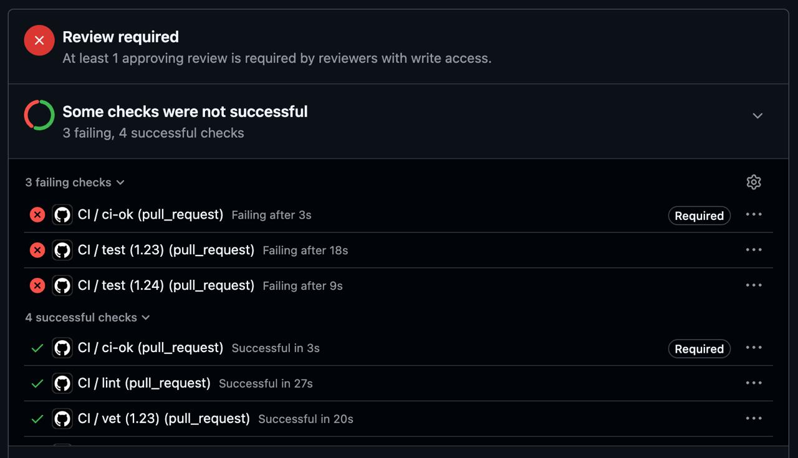
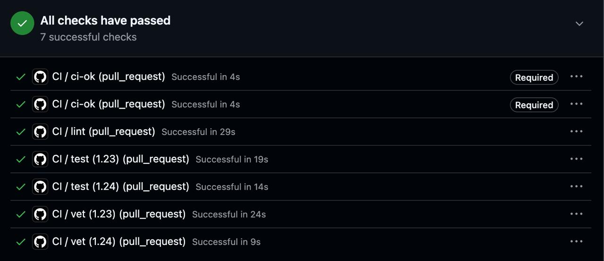
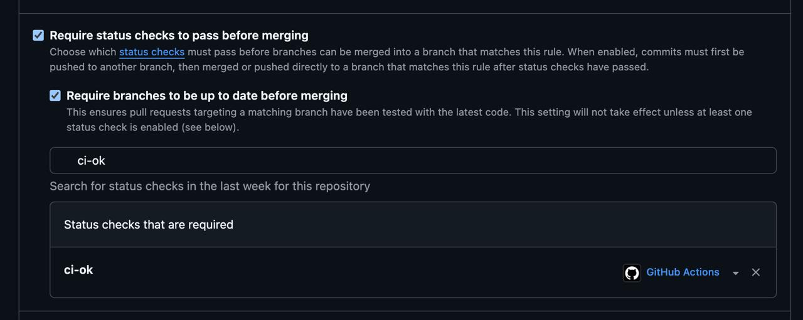
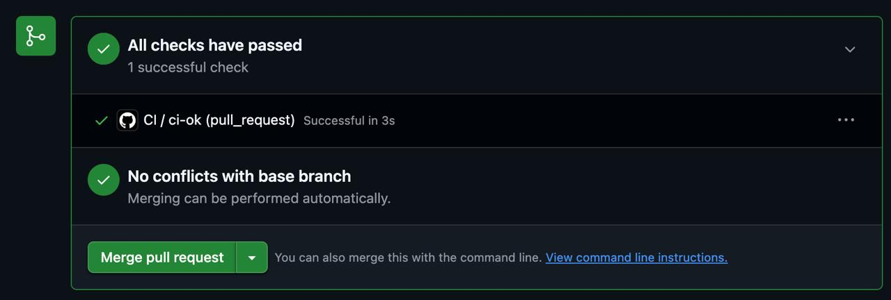

# Lab 3 — CI/CD: A PR-Gated Pipeline for QuickNotes

**Student:** SophiiaSultanova  
**Email:** sultanova2202@gmail.com  
**GitHub:** [@fsstilerr](https://github.com/fsstilerr)  
**Path chosen:** GitHub Actions  
**Environment:** macOS 26.6.2, git 2.55.0, Go 1.27.1

GitHub Actions was chosen because the fork already lives on GitHub and the branch protection configured in the previous labs is what this lab extends.

---

## Task 1 — The PR Gate

Green run: https://github.com/fsstilerr/DevOps-Intro/actions/runs/35292215505

The pipeline runs three independent jobs against `app/`:

- `go vet ./...`
- `go test -race -count=1 ./...`
- `golangci-lint run` pinned to v2.5.0

The runner is pinned to `ubuntu-24.04`, every external action is referenced by a full commit SHA, and `permissions: contents: read` is declared at workflow level.

### Resolving the SHAs

| Action | Tag | Commit SHA |
|--------|-----|------------|
| `actions/checkout` | v4.2.2 | `11bd71901bbe5b1630ceea73d27597364c9af683` |
| `actions/setup-go` | v6.5.0 | `924ae3a1cded613372ab5595356fb5720e22ba16` |
| `actions/cache` | v4.3.0 | `0057852bfaa89a56745cba8c7296529d2fc39830` |
| `golangci/golangci-lint-action` | v8.0.0 | `4afd733a84b1f43292c63897423277bb7f4313a9` |

All four values were resolved locally with `git ls-remote` before being used in the workflow.

The lab specification contains an example that comments
`b4ffde65f46336ab88eb53be808477a3936bae11` as `v4.2.2`, but resolving that SHA shows that it belongs to an older checkout release. This demonstrates an important distinction: a SHA pin guarantees which commit is executed, while the comment beside it is only a human-readable claim.

`golangci-lint-action` also uses an annotated tag. For annotated tags, `git ls-remote` can return both the tag object and the dereferenced commit (`^{}`). The workflow must pin the commit SHA, not the tag-object SHA.

### Local verification

Before pushing the workflow, the same checks were run locally:

```text
$ go vet ./...
(no output, exit code 0)

$ go test -race -count=1 ./...
ok      quicknotes      1.511s

$ golangci-lint run
0 issues.
```

`actionlint` also completed without errors.

### Proving the gate blocks

I deliberately changed the expected notes count in `TestHealth_ReportsCount` from `1` to `99`.

The result was:

```text
test (1.23)  FAILED
test (1.24)  FAILED
ci-ok        FAILED / REQUIRED

vet (1.23)   PASSED
vet (1.24)   PASSED
lint         PASSED
```



After restoring the assertion from `99` back to `1`, all checks passed again:



### Branch protection

The `main` branch is configured with:

- Require status checks to pass before merging
- Require branches to be up to date before merging
- Required status check: `ci-ok`



Only the stable aggregate `ci-ok` check is required. Individual matrix job names are not required directly because names such as `test (1.23)` and `test (1.24)` can change when the matrix changes.

### Design questions

**a) Why pin `ubuntu-24.04` instead of `ubuntu-latest`?**  
`ubuntu-latest` is a moving alias. GitHub can change the underlying runner image without any repository change. Pinning `ubuntu-24.04` makes the environment explicit and reviewable.

**b) Why split vet, test and lint into separate jobs?**  
They run in parallel, failures are easier to diagnose, and one failing command does not hide results from the other classes of checks.

**c) What attack does SHA pinning prevent?**  
A mutable action tag can be retargeted to another commit. Pinning a full commit SHA prevents the workflow from silently executing newly retagged code.

**d) What is `permissions:` and what principle is behind it?**  
It limits the permissions of the workflow's `GITHUB_TOKEN`. `contents: read` follows least privilege because this CI only needs to read the repository.

**e) Stage versus job in GitLab CI, and what does `dependencies:` add?**  
A stage is an ordering boundary, while a job is one execution unit. `dependencies:` controls which artifacts from earlier jobs are downloaded.

---

## Task 2 — Cache, Matrix, Path Filter

### Timings

Each value below is the median of three complete GitHub Actions runs.

| Scenario | Runs | Median wall-clock |
|----------|------|------------------:|
| Baseline (no cache, single Go version, no path filter) | 28 s, 35 s, 44 s | **35 s** |
| With cache, single Go version | 31 s, 38 s, 35 s | **35 s** |
| With cache + matrix | 37 s, 45 s, 77 s | **45 s** |

The cache did not noticeably reduce total wall-clock time in these runs because runner provisioning, checkout, action startup, toolchain setup and normal GitHub-hosted runner variance remain a large fraction of total time.

### Caching

The workflow disables the built-in `setup-go` cache and explicitly caches:

```text
~/.cache/go-build
~/go/pkg/mod
```

The cache key includes the matrix Go version, runner OS and hashes of relevant Go build inputs.

### Matrix

`vet` and `test` use:

```yaml
strategy:
  fail-fast: false
  matrix:
    go: ['1.23', '1.24']
```

Initially the Go 1.23 cells failed with:

```text
go: go.mod requires go >= 1.24 (running go 1.23.12; GOTOOLCHAIN=local)
```

This happens because `app/go.mod` declares Go 1.24 as the minimum supported version.

To preserve the required 1.23/1.24 matrix while allowing the Go toolchain mechanism to satisfy the module requirement, the workflow restores automatic toolchain selection after `setup-go`:

```yaml
- name: Allow Go toolchain auto-switch
  run: echo "GOTOOLCHAIN=auto" >> "$GITHUB_ENV"
```

The important conclusion is that the module itself does not genuinely support Go 1.23. A matrix cell can be labelled 1.23, but the `go 1.24` requirement in `go.mod` remains authoritative.

### Path filter

The main workflow runs only for changes under:

```text
app/**
.github/workflows/ci.yml
```

A second workflow uses the complementary `paths-ignore` behavior and reports a lightweight `ci-ok` for documentation-only pull requests.

A separate docs-only PR was used to demonstrate the behavior:

https://github.com/fsstilerr/DevOps-Intro/pull/3

It changed only `README.md` and produced exactly one successful check:

```text
CI / ci-ok (pull_request)    PASSED
```

`vet`, `test` and `lint` did not run.



### Design questions

**f) Why cache inputs rather than arbitrary build outputs?**  
The important property is provenance: a cached artifact should be tied to the inputs that produced it. Go's build cache is content-addressed, and the outer Actions cache key is also derived from project inputs.

**g) What does `fail-fast: false` change, and when would `true` be preferable?**  
With `false`, all matrix cells finish even after one fails, which gives a complete diagnostic picture. `true` is useful for expensive matrices when one failure is already enough to stop the pipeline.

**h) What is the risk of cache poisoning from a malicious pull request?**  
A poisoned cache entry could influence a later build if it were accepted under a trusted key. Mitigations include narrow input-derived keys, least-privilege permissions, and keeping deployment credentials out of cache-restoring CI jobs.

---

## Bonus Task — Performance Investigation

Three optimizations were investigated:

1. Go build cache restoration through `actions/cache`
2. Race detection limited to one matrix cell
3. `GOFLAGS=-buildvcs=false`

### Before/after measurements

| Optimization | Before | After | Observed saving |
|--------------|-------:|------:|----------------:|
| Build cache on single-version pipeline | 35 s | 35 s | 0 s |
| `-race` limited to one matrix cell | 45 s | 43 s | 2 s |
| `GOFLAGS=-buildvcs=false` | not isolated | not isolated | not separately measured |

After limiting `-race` to the Go 1.24 matrix cell, three complete runs were:

```text
39 s
43 s
63 s
```

Median: **43 s**.

The previous cache + matrix median was **45 s**, so the observed median wall-clock improvement was **2 seconds**.

The final test command is:

```yaml
- run: go test ${{ matrix.go == '1.24' && '-race' || '' }} -count=1 ./...
```

This preserves race-detector coverage while avoiding duplicate race instrumentation in both matrix cells.

The workflow also uses:

```yaml
env:
  GOFLAGS: -buildvcs=false
```

Its effect was not benchmarked independently, so no separate numeric saving is claimed.

### Bottleneck analysis

The remaining bottleneck is mostly outside the QuickNotes code. GitHub-hosted jobs start on fresh runners and must perform runner provisioning, checkout, action startup and Go toolchain setup before the actual validation commands run.

This also explains the variance in otherwise similar runs. The cache + matrix measurements ranged from 37 s to 77 s with the same repository contents.

Further micro-optimizations therefore have diminishing returns. A self-hosted runner or prebuilt environment could reduce provisioning and setup time, but would add infrastructure and maintenance cost.

---

## Summary

| Task | Deliverable | Status |
|------|-------------|--------|
| Task 1 | Three-job gate, pinned runner and SHAs, restricted permissions, branch protection, deliberate failure and fix | Done |
| Task 2 | Cache, Go matrix, path filter, aggregate `ci-ok`, repeated timing measurements | Done |
| Bonus | Performance investigation, race-detector optimization, cache analysis, bottleneck discussion | Done |
