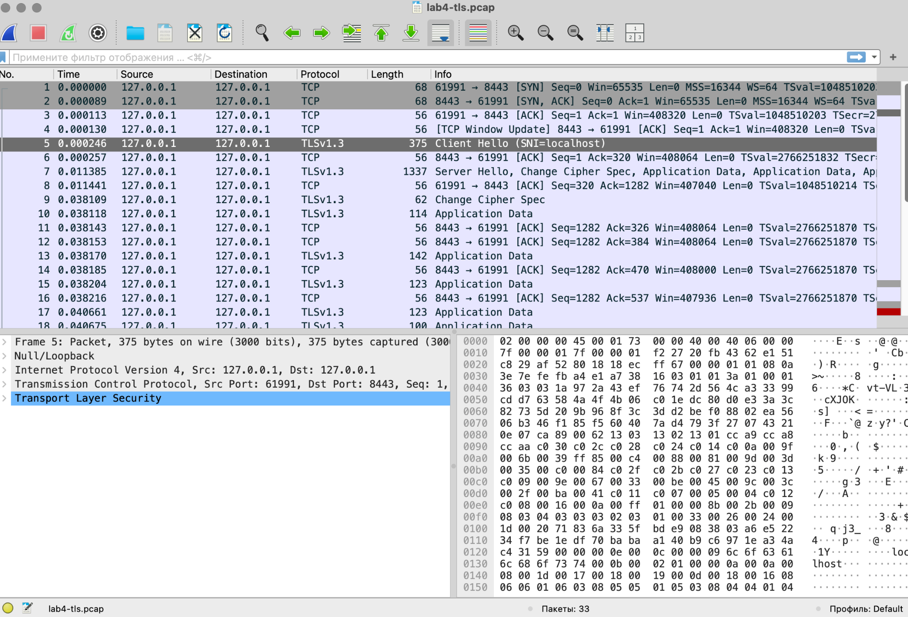
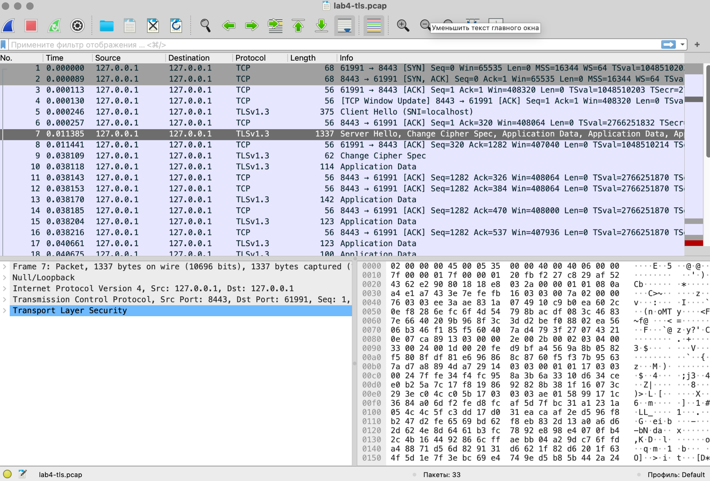

# Lab 4 — OS & Networking: Trace, Debug, and Read the Substrate

**Student:** SophiiaSultanova  
**Email:** sultanova2202@gmail.com  
**GitHub:** [@fsstilerr](https://github.com/fsstilerr)  
**Environment:** macOS 26.6.2, Go 1.27.1, system `curl`, system `tcpdump`

## A note on platform

The lab is written for Linux and assumes tools such as `ss`, `ip`,
`journalctl`, `iptables`, and the `lo` interface. This machine is macOS, so I
used the macOS tools that query the same layers:

| Purpose | Linux command | macOS command used | Layer |
|---|---|---|---|
| Listening sockets | `ss -tlnp` | `lsof -nP -iTCP:8080 -sTCP:LISTEN` | kernel socket table |
| Routes | `ip route show` | `netstat -rn`, `route -n get default` | routing table |
| Service logs | `journalctl` | `log show --predicate 'process == "quicknotes"'` | unified logging |
| Firewall | `iptables -L -n -v` | `pfctl -sr` | packet filter |
| Loopback capture | `tcpdump -i lo` | `tcpdump -i lo0` | loopback interface |
| OS resolver | `getent hosts` | `dscacheutil -q host -a name` | OS resolver |

`tcpdump -i any` is a Linux-specific convenience, so the macOS loopback device
`lo0` was used explicitly.

---

## Task 1 — Tracing One Request End to End

### 1.1 Capture

QuickNotes was started on port 8080 and one POST request was captured on the
loopback interface:

```bash
sudo tcpdump -i lo0 -nn -s 0 -A 'tcp port 8080' -w lab4-trace.pcap

curl -v -X POST http://127.0.0.1:8080/notes \
  -H 'Content-Type: application/json' \
  -d '{"title":"trace me","body":"in flight"}'
```

`127.0.0.1` was used deliberately so the trace is IPv4 and easy to read.

### 1.2 Annotated packet trace

The actual capture contained 12 packets:

```text
04:25:58.001737 IP 127.0.0.1.50378 > 127.0.0.1.8080: Flags [S], length 0
04:25:58.001810 IP 127.0.0.1.8080 > 127.0.0.1.50378: Flags [S.], length 0
04:25:58.001834 IP 127.0.0.1.50378 > 127.0.0.1.8080: Flags [.], length 0
04:25:58.001853 IP 127.0.0.1.8080 > 127.0.0.1.50378: Flags [.], length 0
04:25:58.001866 IP 127.0.0.1.50378 > 127.0.0.1.8080: Flags [P.], length 174: HTTP: POST /notes HTTP/1.1
04:25:58.001899 IP 127.0.0.1.8080 > 127.0.0.1.50378: Flags [.], length 0
04:25:58.009534 IP 127.0.0.1.8080 > 127.0.0.1.50378: Flags [P.], length 203: HTTP: HTTP/1.1 201 Created
04:25:58.009587 IP 127.0.0.1.50378 > 127.0.0.1.8080: Flags [.], length 0
04:25:58.009650 IP 127.0.0.1.50378 > 127.0.0.1.8080: Flags [F.], length 0
04:25:58.009686 IP 127.0.0.1.8080 > 127.0.0.1.50378: Flags [.], length 0
04:25:58.009700 IP 127.0.0.1.8080 > 127.0.0.1.50378: Flags [F.], length 0
04:25:58.009730 IP 127.0.0.1.50378 > 127.0.0.1.8080: Flags [.], length 0
```

| Packets | Meaning |
|---|---|
| 1–3 | TCP three-way handshake: `SYN` → `SYN,ACK` → `ACK` |
| 4 | extra server ACK / TCP window update |
| 5 | application request: `POST /notes`, 174 bytes |
| 6 | kernel ACK of the request |
| 7 | application response: `HTTP/1.1 201 Created`, 203 bytes |
| 8 | client ACK of the response |
| 9–12 | connection teardown: client FIN, server ACK, server FIN, final ACK |

The request arrived at 04:25:58.001866 and the response packet was sent at
04:25:58.009534, about **7.7 ms later**.

The kernel ACK for the request was sent only about **33 microseconds** after the
request packet arrived. This is an important distinction: a TCP ACK means that
the kernel accepted bytes into the socket buffer. It does not prove that the
application has processed the request.

### 1.3 Five debugging commands

#### Listening socket

```text
COMMAND    PID   USER               FD   TYPE  NAME
quicknote  7753  sophiyasultanova    5u  IPv6  TCP *:8080 (LISTEN)
```

#### Routes

```text
destination: default
gateway: 10.240.16.1
interface: en0
```

#### Reachability

```text
HOST: MacBook-Pro-Sophiya-2.local Loss%  Snt  Last  Avg  Best  Wrst  StDev
1.|-- localhost                    0.0%     5   1.0  1.0   0.9   1.2   0.1
```

#### DNS and resolver

```text
$ dig +short example.com @1.1.1.1
8.47.69.0
8.6.112.0

$ dig +short localhost
127.0.0.1

$ dscacheutil -q host -a name localhost
name: localhost
ipv6_address: ::1

name: localhost
ip_address: 127.0.0.1
```

On this macOS installation `dig localhost` returned `127.0.0.1`. The important
point is that `dig` and the OS resolver are different diagnostic paths, so I
recorded the actual behavior of this machine rather than assuming they must
disagree.

#### Process logs

```text
2026-09-18 04:20:30.267265+0300 ... PID 7753 ... quicknotes: (libsystem_info.dylib) Retrieve User by ID
```

Because QuickNotes was launched directly from a terminal, its application log
output was primarily visible in that terminal rather than in macOS unified
logging.

### 1.4 What I would check first on a 502

A 502 normally means a proxy received the client request but failed to obtain a
usable upstream response.

I would first capture traffic on the upstream port. The packet pattern separates
several cases quickly:

- no SYN at all: wrong destination, configuration, or name resolution;
- SYN immediately followed by RST: nothing is listening on the upstream port;
- handshake succeeds but no application response follows: process is reachable
  but stuck, too slow, or failing after accept;
- a valid upstream response is present: the failure is likely in the proxy's
  interpretation, timeout, or forwarding path.

---

## Task 2 — Outside-In Debugging on a Broken Deploy

### 2.1 Reproducing the failure

With one QuickNotes instance already holding port 8080, a second instance was
started:

```text
2026/09/18 04:31:09 quicknotes listening on :8080 (notes loaded: 9)
2026/09/18 04:31:09 listen: listen tcp :8080: bind: address already in use
exit status 1
```

The root cause is explicit:

```text
bind: address already in use
```

### The health check was green even though the new deploy failed

The original process was still listening:

```text
COMMAND    PID   USER               FD   TYPE  NAME
quicknote  7753  sophiyasultanova    5u  IPv6  TCP *:8080 (LISTEN)
```

At the same time:

```text
HTTP 200
{"notes":9,"status":"ok"}
```

So `/health` was green even though the new process had already failed.

### 2.2 Outside-in debugging chain

| Step | Command | Finding | Decision |
|---|---|---|---|
| 1 | `ps -ef \| grep quicknotes` | one QuickNotes process remained | the new instance exited; inspect its log |
| 2 | `lsof -nP -iTCP:8080 -sTCP:LISTEN` | PID 7753 held port 8080 | port conflict confirmed |
| 3 | `curl http://127.0.0.1:8080/health` | HTTP 200, `{"notes":9,"status":"ok"}` | response came from the old instance |
| 4 | `pfctl -sr` | normal macOS anchor/scrub rules were visible | no evidence of loopback filtering causing the failure |
| 5 | `dig` + `dscacheutil` | localhost resolved to loopback | resolver was not the cause |
| 6 | `/tmp/qn-broken.log` | `bind: address already in use` | root cause established |

The broken deploy log was:

```text
2026/09/18 04:31:09 quicknotes listening on :8080 (notes loaded: 9)
2026/09/18 04:31:09 listen: listen tcp :8080: bind: address already in use
exit status 1
```

### 2.3 Repair and re-verification

When I later attempted to stop PID 7753, it had already exited, so the shell
reported:

```text
kill: kill 7753 failed: no such process
```

The service was then started again on a free port. Subsequent reverse-proxy and
TLS tests succeeded, confirming that QuickNotes was again available.

### Blameless mini-postmortem

The operating system behaved correctly: it refused to allow two processes to
bind the same listening address.

The confusing part was observability. The second process printed a
readiness-looking log message before the bind failure, while the old process
continued to answer `/health`. An operator looking only at the log line or the
health endpoint could incorrectly conclude that the deployment succeeded.

Three improvements would make this class of failure easier to diagnose:

1. print the readiness message only after the listener has been successfully
   created;
2. include instance identity in `/health`, such as build SHA and process start
   time;
3. let a supervisor or process manager own restart behavior so that two
   competing copies cannot silently create ambiguous health signals.

---

## Bonus Task — Decoding the TLS Handshake

### B.1 and B.2 — TLS proxy and capture

Caddy was installed with Homebrew and run locally with:

```text
localhost:8443 {
  reverse_proxy 127.0.0.1:8080
}
```

A TLS capture was recorded on `lo0` for port 8443.

The successful TLS 1.3 connection negotiated:

```text
Protocol: TLSv1.3
Cipher: TLS_AES_128_GCM_SHA256
Negotiated TLS1.3 group: X25519MLKEM768
Peer signature type: ecdsa_secp256r1_sha256
```

### B.3 ClientHello and ServerHello in Wireshark

Wireshark showed a clear ClientHello:

```text
Frame 5
TLSv1.3
Client Hello (SNI=localhost)
```



It also showed the ServerHello:

```text
Frame 7
TLSv1.3
Server Hello, Change Cipher Spec, Application Data, ...
```



After ServerHello, TLS 1.3 encrypts the later handshake messages. That is why a
passive packet capture shows application-data records rather than a readable
certificate chain.

The chain was therefore inspected with `openssl s_client`, which participates in
the handshake.

### Certificate chain

```text
0 s:
   i:CN=Caddy Local Authority - ECC Intermediate

1 s:CN=Caddy Local Authority - ECC Intermediate
   i:CN=Caddy Local Authority - 2026 ECC Root

New, TLSv1.3, Cipher is TLS_AES_128_GCM_SHA256
Protocol: TLSv1.3
Verify return code: 20 (unable to get local issuer certificate)
```

The leaf certificate was issued by Caddy's local ECC intermediate, and the
intermediate was issued by Caddy's local 2026 ECC root.

`Verify return code: 20` means this OpenSSL invocation did not have the Caddy
local root in its trust store. It does not mean the TLS key exchange failed.

### Which negotiation step rejects TLS 1.1

The first TLS 1.1 attempt failed on the client side:

```text
error:0A0000BF:SSL routines:tls_setup_handshake:no protocols available
SSL handshake has read 0 bytes and written 7 bytes
```

When the OpenSSL security level was explicitly lowered, the client sent a TLS
1.1 offer but Caddy rejected it:

```text
error:0A00042E:SSL routines:ssl3_read_bytes:tlsv1 alert protocol version
SSL alert number 70

SSL handshake has read 7 bytes and written 123 bytes

Protocol: TLSv1.1
Cipher: 0000
```

Alert 70 is `protocol_version`, so the rejection happens during version
negotiation.

For comparison, TLS 1.2 was accepted:

```text
Protocol: TLSv1.2
Cipher: ECDHE-ECDSA-AES128-GCM-SHA256
Peer Temp Key: X25519, 253 bits
```

---

## Summary

| Task | Deliverable | Status |
|---|---|---|
| Task 1 | 12-packet annotated request capture, five macOS debugging checks, 502 reasoning | Done |
| Task 2 | Broken deploy reproduced, outside-in chain, root cause and postmortem | Done |
| Bonus | TLS 1.3 handshake, Wireshark ClientHello/ServerHello, certificate chain, TLS 1.1 rejection | Done |

The main lesson is that each diagnostic layer proves only a narrow fact. A TCP
ACK proves that the kernel accepted bytes, not that the application processed
them. A green `/health` proves that some process answered, not necessarily the
new deployment. A readiness-looking log line can appear before a bind actually
succeeds. In TLS 1.3, a passive capture reveals the initial negotiation but not
the readable certificate chain after ServerHello.
