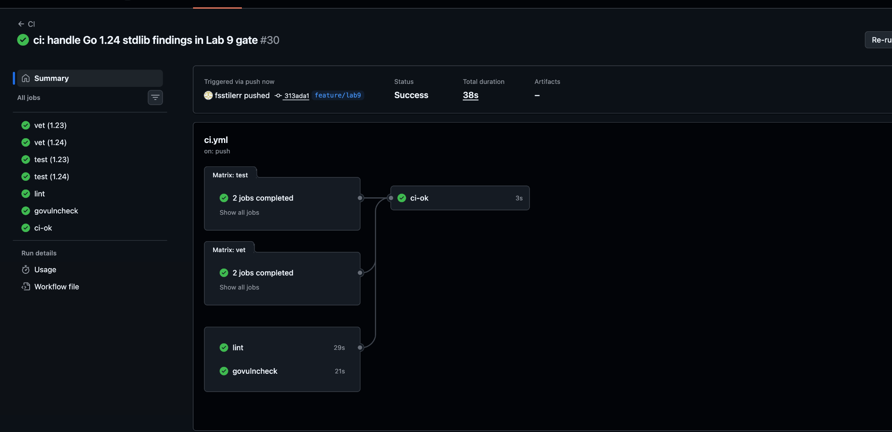
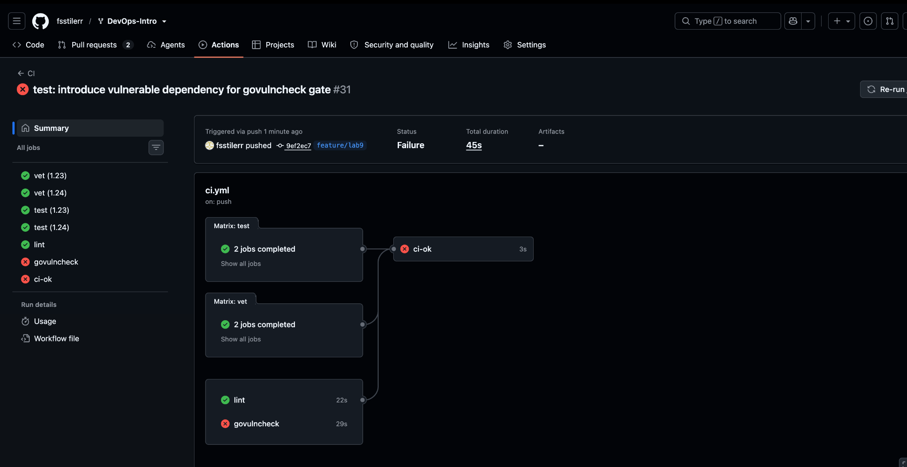
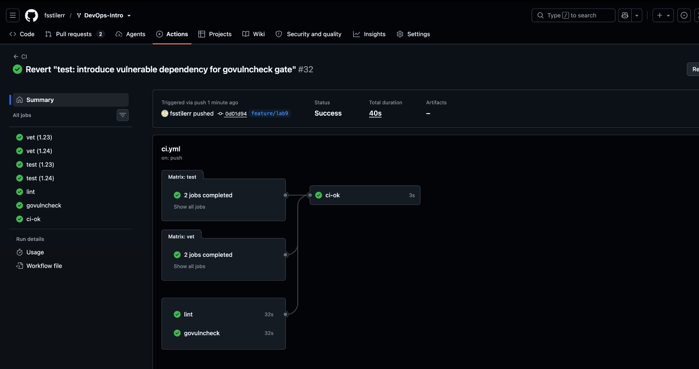

# Lab 9 — DevSecOps: Trivy + ZAP

Student: Sofiia Sultanova  
GitHub: `@fsstilerr`  
Branch: `feature/lab9`  
PR: `#1743`

---

## Task 1 — Trivy: Image + Filesystem + Config + SBOM

Pinned Trivy: `aquasec/trivy:0.59.1`

### Scan results

**Image — before** (`docs/evidence/lab9/trivy-image.txt`)

```text
quicknotes:lab6 (debian 12.15)
Total: 0 (HIGH: 0, CRITICAL: 0)

healthcheck (gobinary)
Total: 22 (HIGH: 21, CRITICAL: 1)

quicknotes (gobinary)
Total: 22 (HIGH: 21, CRITICAL: 1)
```

The findings came from the Go stdlib compiled into both binaries. I upgraded the builder to `golang:1.26.8-alpine`, rebuilt the image and rescanned.

**Image — after** (`docs/evidence/lab9/trivy-image-final2.txt`)

```text
Total: 0 (HIGH: 0, CRITICAL: 0)
```

**Filesystem** (`docs/evidence/lab9/trivy-fs.txt`)

```text
.vagrant/machines/default/virtualbox/private_key (secrets)
Total: 1 (HIGH: 1, CRITICAL: 0)
HIGH: AsymmetricPrivateKey (private-key)
```

The key is generated by Vagrant, `.vagrant/` is ignored by Git, and `git ls-files` confirmed it is not tracked.

**Config** (`docs/evidence/lab9/trivy-config.txt`)

```text
Tests: 28 (SUCCESSES: 27, FAILURES: 1)
Failures: 1 (UNKNOWN: 0, LOW: 1, MEDIUM: 0, HIGH: 0, CRITICAL: 0)
AVD-DS-0026 (LOW): Add HEALTHCHECK instruction in your Dockerfile
```

No HIGH/CRITICAL config findings. The service healthcheck is defined in `compose.yaml`.

### HIGH / CRITICAL triage

All 22 Go findings affected both `quicknotes` and `healthcheck`.

| Finding | Severity | Disposition |
| --- | --- | --- |
| `CVE-2025-68121` | CRITICAL | **FIX¹** |
| `CVE-2025-61726` | HIGH | **FIX¹** |
| `CVE-2025-61729` | HIGH | **FIX¹** |
| `CVE-2026-25679` | HIGH | **FIX¹** |
| `CVE-2026-27145` | HIGH | **FIX¹** |
| `CVE-2026-32280` | HIGH | **FIX¹** |
| `CVE-2026-32281` | HIGH | **FIX¹** |
| `CVE-2026-32283` | HIGH | **FIX¹** |
| `CVE-2026-33811` | HIGH | **FIX¹** |
| `CVE-2026-33814` | HIGH | **FIX¹** |
| `CVE-2026-33818` | HIGH | **FIX¹** |
| `CVE-2026-39820` | HIGH | **FIX¹** |
| `CVE-2026-39821` | HIGH | **FIX¹** |
| `CVE-2026-39822` | HIGH | **FIX¹** |
| `CVE-2026-39836` | HIGH | **FIX¹** |
| `CVE-2026-42499` | HIGH | **FIX¹** |
| `CVE-2026-42504` | HIGH | **FIX¹** |
| `CVE-2026-56853` | HIGH | **FIX¹** |
| `CVE-2026-56858` | HIGH | **FIX¹** |
| `CVE-2026-56859` | HIGH | **FIX¹** |
| `CVE-2026-56860` | HIGH | **FIX¹** |
| `CVE-2026-56862` | HIGH | **FIX¹** |
| `.vagrant/.../private_key` | HIGH | **ACCEPT²** |

**¹ FIX:** upgraded Go `1.24.5 → 1.26.8`, rebuilt `quicknotes:lab6`; final Trivy scan is `0 HIGH / 0 CRITICAL`. Fix: commit `07d010f`.

**² ACCEPT:** Vagrant-generated local VM key; Git-ignored, not tracked and not shipped in the image. Re-evaluate by **2027-04-06**.

### CycloneDX SBOM

`docs/evidence/lab9/quicknotes-sbom.cdx.json`

First 30 lines:

```json
{
  "$schema": "http://cyclonedx.org/schema/bom-1.6.schema.json",
  "bomFormat": "CycloneDX",
  "specVersion": "1.6",
  "serialNumber": "urn:uuid:812a0552-f4f0-42c6-bd6d-cc8369e6ac9e",
  "version": 1,
  "metadata": {
    "timestamp": "2026-10-06T13:56:51+00:00",
    "tools": {
      "components": [
        {
          "type": "application",
          "group": "aquasecurity",
          "name": "trivy",
          "version": "0.59.1"
        }
      ]
    },
    "component": {
      "bom-ref": "pkg:oci/quicknotes@sha256%3Aa148ae30122f9745e5ebff88c6b45ad021e4dceae229570941b72c3a7fd5c029?arch=arm64&repository_url=index.docker.io%2Flibrary%2Fquicknotes",
      "type": "container",
      "name": "quicknotes:lab6",
      "purl": "pkg:oci/quicknotes@sha256%3Aa148ae30122f9745e5ebff88c6b45ad021e4dceae229570941b72c3a7fd5c029?arch=arm64&repository_url=index.docker.io%2Flibrary%2Fquicknotes",
      "properties": [
        {
          "name": "aquasecurity:trivy:DiffID",
          "value": "sha256:114dde0fefebbca13165d0da9c500a66190e497a82a53dcaabc3172d630be1e9"
        },
        {
          "name": "aquasecurity:trivy:DiffID",
```

### Design questions

#### a) What matters besides CVE severity?
Reachability, exploit availability, exposure, privileges, compensating controls and whether a patched version exists. A reachable public issue can matter more than a higher-severity unreachable one.

#### b) Why is a minimal base image a strong control?
Less software means fewer vulnerable packages and fewer tools available after compromise. Here the distroless runtime had no HIGH/CRITICAL findings; the findings were inside the Go binaries.

#### c) When is `.trivyignore` legitimate?
Only for a narrow, understood and documented exception with a re-check date, for example an unreachable issue or no available upstream fix. Using it only to make CI green is security theater.

#### d) Why keep an SBOM?
It gives an inventory of shipped components, so after a new CVE appears I can quickly check whether the deployed image contains the affected component/version.

---

## Task 2 — OWASP ZAP Baseline + Fix

Pinned ZAP: `ghcr.io/zaproxy/zaproxy:2.16.1`  
Only `zap-baseline.py` was used.

### Before

Reports:
- `docs/evidence/lab9/zap-before.html`
- `docs/evidence/lab9/zap-before.json`
- `docs/evidence/lab9/zap-before.txt`

| ID | Finding | Risk | URL | Decision |
| --- | --- | --- | --- | --- |
| `10116` | ZAP is Out of Date | Low | `/` | **SUPPRESS** — scanner-version warning, not a QuickNotes issue |
| `10049` | Storable and Cacheable Content | Informational | `/` | **FIX** — add `Cache-Control: no-store` globally |

### Fix

`app/handlers.go` now wraps the whole router with `securityHeaders`:

```go
w.Header().Set("Cache-Control", "no-store")
w.Header().Set("Content-Security-Policy", "default-src 'none'")
w.Header().Set("X-Content-Type-Options", "nosniff")
w.Header().Set("X-Frame-Options", "DENY")
w.Header().Set("Referrer-Policy", "no-referrer")
```

`app/security_headers_test.go` checks the headers on `/health`, `/notes` and an unknown route.

```text
go test ./...
ok      quicknotes
```

Runtime check:

```text
HTTP/1.1 200 OK
Cache-Control: no-store
Content-Security-Policy: default-src 'none'
Referrer-Policy: no-referrer
X-Content-Type-Options: nosniff
X-Frame-Options: DENY
```

### After

Reports:
- `docs/evidence/lab9/zap-after.html`
- `docs/evidence/lab9/zap-after.json`
- `docs/evidence/lab9/zap-after.txt`

The original `Storable and Cacheable Content` finding is gone. ZAP now reports:

| ID | Finding | Decision |
| --- | --- | --- |
| `10116` | ZAP is Out of Date | **SUPPRESS** — pinned scanner warning |
| `10049` | Non-Storable Content | **ACCEPT** — expected from `Cache-Control: no-store`; re-evaluate by **2027-04-06** |

### Design questions

#### e) Why middleware?
One wrapper applies the policy to every current and future route and is easier to test than duplicated header code.

#### f) What does `default-src 'none'` break?
It blocks browser resources such as scripts, styles and images. That is fine for QuickNotes because it is a JSON API, but it would be too strict for a normal website without allowlists.

#### g) Why not accept every informational finding?
Severity does not decide business impact. Blind acceptance hides real issues and makes scanner results meaningless; each finding still needs a reasoned decision.

---

## Bonus — `govulncheck` CI Gate

CI workflow: `.github/workflows/ci.yml`

The job:
- runs `govulncheck ./...` from `app/`;
- uses Go `1.24`;
- pins `govulncheck` to `v1.1.4`;
- has its own `govulncheck` status check;
- is included in `ci-ok`.

The current Go vulnerability database reports reachable stdlib findings for the course-required Go 1.24 toolchain, while the shipped image is built with patched Go 1.26.8. The CI wrapper keeps those stdlib findings visible as a compatibility warning and still fails on reachable third-party module vulnerabilities.

### Red → green proof

Baseline GREEN:



Temporary vulnerable commit:

```text
9ef2ec7 test: introduce vulnerable dependency for govulncheck gate
```

It added `golang.org/x/text v0.3.7` with a reachable `language.ParseAcceptLanguage` call. `govulncheck` became RED while vet/test/lint stayed green:



After reverting the temporary dependency:

```text
0d01d94 Revert "test: introduce vulnerable dependency for govulncheck gate"
```

CI returned to GREEN:



### Design questions

#### h) Why does reachability matter?
A module can contain a CVE without QuickNotes calling the affected function. Reachability reduces false-positive triage and prioritizes vulnerabilities the application can actually execute.

#### i) Why pin `govulncheck`?
A pinned scanner makes CI reproducible; `@latest` can change behavior or requirements without any repository change.

#### j) What does Trivy catch that `govulncheck` does not?
OS/base-image CVEs, secrets and container/configuration issues. `govulncheck` focuses on Go vulnerabilities and call-graph reachability.

---

## Result

- Task 1: completed — Trivy scans, SBOM and triage
- Task 2: completed — ZAP triage, middleware fix and test
- Bonus: completed — `govulncheck` gate with GREEN → RED → GREEN proof
